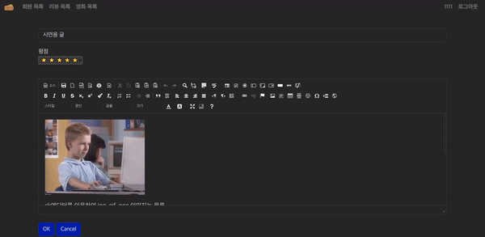

# 📖 1021_pairpjt

> 일시 : 2022-10-21
> 
> 팀 구성 : 개인제작

## 🖥️ 프로젝트 시연





## 🧭 목표

- **CRUD** 구현
- **Staticfiles** 활용 정적 파일(이미지, CSS, JS) 다루기
- Django **Auth** 활용 회원 관리 구현
- Media 활용 동적 파일 다루기
- 모델간 1 : N 관계 매핑 코드 작성 및 활용
  - 유저 - 리뷰
  - 리뷰 - 댓글
  - 유저 - 댓글

## ⚙️ Stacks

       

## 🧱  기능 소개

- 구현된 기능
1. 회원 관리 기능
   
   1. 회원 가입
   2. 회원 정보 수정
   3. 비밀번호 수정
   4. 로그인, 로그아웃
   5. 회원 탈퇴

2. 게시글 기능
   
   1. 영화 크롤링을 이용한 기초 데이터 생성
   2. 외래키 연결을 통한 데이터 연결
   3. CRUD 기반 게시판 시스템 
   4. CKeditor를 통한 게시글 작성
- 미구현된 기능
1. Ajax를 이용한 댓글 처리 기능

## 💡경험 및 미흡한 점

1. 게시판에서 상당히 자주 사용되는 ck에디터를 이용해 프로젝트를 진행하였다. 
   - 앱 설치부터 경로 지정까지 엄청나게 고생은 했는데 강력한 기능들이 많아 만족스러움. 
2. ck에디터의 이미지 업로드 권한은 **스태프**로만 설정되어 있다. <br>
   유저 로그인시 작동하는걸로 가상환경에서 꼭 변경해야 한다.
      ``` python
      #{가상환경} /Lib/site-packages/ckeditor_uploader/urls.py
      urlpatterns = [
         re_path(r"^upload/", login_required(views.upload), name="ckeditor_upload"),
         re_path(
            r"^browse/",
            never_cache(login_required(views.browse)),
            name="ckeditor_browse",
         ),
      ]
      ```
3. 게시글 삭제시 게시글에 포함된 이미지도 삭제하는 방식도 구현이 필요하다 생각함. 

